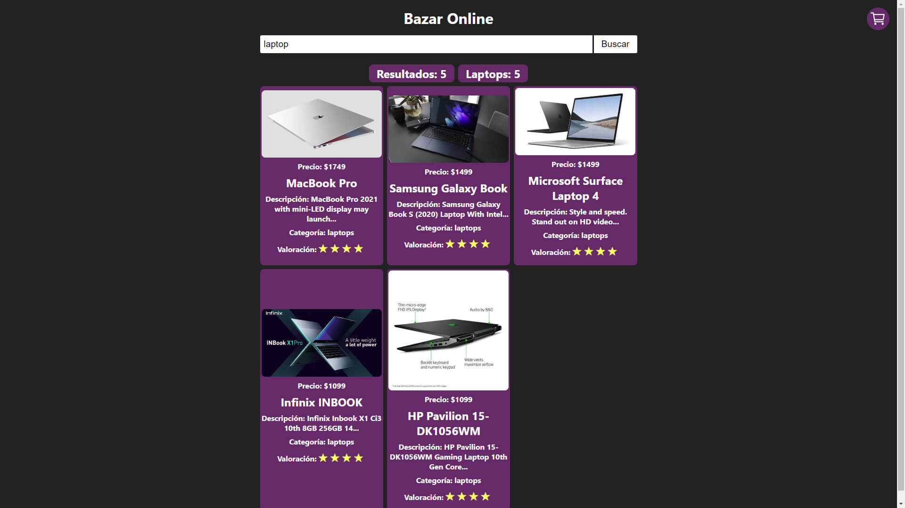
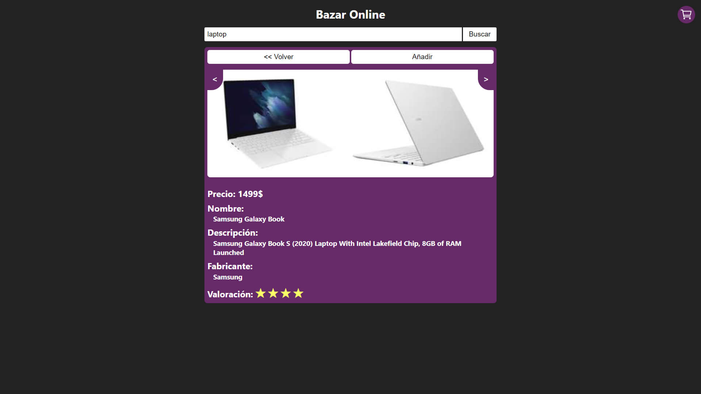

# 02 - Bazar Universal

Esta es la segunda prueba técnica que consiste en un bazar para la adquisición de varios productos de todo tipo.

Esta es la parte frontend, para ver el backend hacer click [aquí](https://github.com/jaamdev/prueba-bazar-universal-backend).

| [Ir al despliegue](https://prueba-bazar-universal-frontend.vercel.app/) | [Ir a la web de los retos](https://pruebastecnicas.com) | [Ir al repositorio de los retos](https://github.com/midudev/pruebas-tecnicas/tree/main/pruebas/02-bazar-universal) |
| :-: | :-: | :-: |

## Scripts

```bash
# instalar las dependencias
npm i
# iniciar el proyecto
npm run dev
```

## Vista



## Requisitos

Crear aplicación que conste de 3 componentes principales:

✅ Caja de búsqueda

✅ Lista de resultados

✅ Detalles del producto

Crear una api que la aplicación debe consumir con dos endpoints:

- <code>/api/items?q=:query</code> donde <code>:query</code> es la búsqueda que hace el usuario. Debe devolver un JSON con los datos a mostrar en la lista de items.

- <code>/api/items/:id</code>, donde <code>:id</code> es el id del producto seleccionado. Debe devolver un JSON con los datos del item seleccionado.